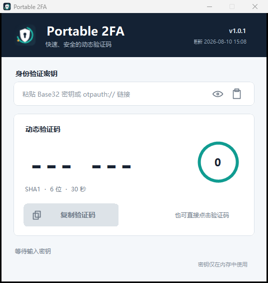

<div align="center">
  
  <h1>Portable 2FA</h1>
  <p>轻量、便携、无网络依赖的 Windows TOTP 动态验证码生成器。</p>
  <p>
    <a href="https://github.com/miao8818/Portable2FA/releases/latest">下载最新版</a>
    · <a href="CHANGELOG.md">更新日志</a>
    · <a href="LICENSE">MIT License</a>
  </p>
  <p>
    <a href="https://linux.do/"></a>
    
    
    
  </p>
</div>



## 项目介绍

Portable 2FA 是一个面向 Windows 的本地 TOTP 验证码工具。粘贴 Base32 密钥或
`otpauth://` 链接后即可生成动态验证码，界面会同步显示剩余时间，点击验证码或
复制按钮即可写入剪贴板。

程序使用系统 WinForms 组件，最终产物是一个约 100 KB 的单文件 EXE。无需安装、
无需账户、无需联网，不包含遥测、广告或后台服务。

## 主要功能

- 支持 Base32 密钥及 `otpauth://totp/...` 链接。
- 支持 SHA1、SHA256、SHA512。
- 支持 6 位、8 位验证码和 5 至 300 秒周期。
- 环形倒计时，验证码切换时自动刷新。
- 点击验证码或按钮复制，托盘菜单也可直接复制。
- 关闭或最小化窗口后进入系统托盘。
- 单实例运行；重复启动会唤醒已有窗口。
- 应用图标和高对比度托盘图标均包含多种尺寸。
- 密钥仅驻留进程内存，不保存到磁盘。

## 下载与使用

从 [Releases](https://github.com/miao8818/Portable2FA/releases/latest) 下载
`Portable2FA.exe`，双击即可运行。

1. 粘贴 Base32 密钥或 `otpauth://` 链接。
2. 等待验证码出现。
3. 点击验证码或“复制验证码”按钮。
4. 关闭窗口后，双击托盘图标可恢复；右键托盘图标可彻底退出。

> Windows 可能对新发布且未购买代码签名证书的 EXE 显示信誉提示。你可以下载源码，
> 使用仓库中的构建脚本自行生成相同程序。

## 隐私与安全

- 不联网：项目没有任何网络请求代码。
- 不持久化：密钥不会写入配置、注册表或文件。
- 不记录：没有日志、遥测、崩溃上传或分析 SDK。
- 剪贴板：仅在用户主动复制时写入当前验证码。
- 可审计：TOTP、界面、图标生成、构建和测试代码全部在本仓库中。

## 完整开源声明

本项目采用 [MIT License](LICENSE) 完整开源，不存在未公开的业务模块、付费模块、
远程服务端或私有构建步骤。GitHub Release 中的 EXE 由本仓库源码和 `build.ps1`
生成；应用图标与托盘图标由公开的 `IconMaker.cs` 确定性生成。

本项目认可并友链 [LINUX DO](https://linux.do/) 社区，遵循社区的
[开源推广要求](https://linux.do/t/topic/1776670)。

## 源码构建

要求：Windows、PowerShell 5.1 或更高版本、系统自带的 .NET Framework C# 编译器。

```powershell
git clone https://github.com/miao8818/Portable2FA.git
cd Portable2FA
.\build.ps1 -OutputDirectory .
```

构建脚本会：

1. 从 `version.json` 读取版本号和更新时间。
2. 生成多尺寸应用图标与托盘图标。
3. 编译单文件 Windows EXE。
4. 编译并运行 RFC 6238、Base32 和 `otpauth://` 测试。

## 版本与更新时间规则

`version.json` 是唯一版本数据源。每次功能、修复或文档发布都必须：

```powershell
.\update-version.ps1 -Part patch   # 也可使用 minor 或 major
```

随后更新 `CHANGELOG.md` 并重新运行构建。构建脚本会把版本号写入 EXE 文件属性，
同时把版本号和更新时间显示在软件界面右上角。详细流程见 [CONTRIBUTING.md](CONTRIBUTING.md)。

## 项目文件说明

| 文件或目录 | 作用 |
| --- | --- |
| `README.md` | GitHub 项目介绍、使用方法、完整开源声明和文件索引。 |
| `Program.cs` | 程序入口、程序集信息、单实例互斥与窗口唤醒。 |
| `MainForm.cs` | 主窗口、密钥输入、验证码刷新、复制及托盘生命周期。 |
| `Controls.cs` | 圆角面板、按钮、输入图标和倒计时环等自绘控件。 |
| `Totp.cs` | Base32 解码、`otpauth://` 解析与 RFC 6238 TOTP 实现。 |
| `TestHarness.cs` | 22 项 RFC 6238、Base32 与 URI 解析回归检查。 |
| `IconMaker.cs` | 确定性生成多尺寸应用 ICO、托盘 ICO 和预览 PNG。 |
| `app.manifest` | Windows 权限、兼容性和 Per-Monitor V2 DPI 配置。 |
| `build.ps1` | 读取版本、生成资源、编译 EXE 并运行测试。 |
| `update-version.ps1` | 递增语义化版本并写入当前时区更新时间。 |
| `version.json` | 当前版本号与 ISO 8601 更新时间的唯一数据源。 |
| `Resources/app.ico` | Windows 程序文件和窗口使用的多尺寸图标。 |
| `Resources/tray.ico` | 针对小尺寸显示优化的系统托盘图标。 |
| `Resources/app-preview.png` | README 和项目页面使用的图标预览。 |
| `Resources/screenshot.png` | README 使用的主界面截图。 |
| `使用说明.md` | 面向普通用户的中文快速使用说明。 |
| `CHANGELOG.md` | 按版本记录新增、修改与修复内容。 |
| `CONTRIBUTING.md` | 贡献方式及强制版本发布流程。 |
| `SECURITY.md` | 密钥安全边界和漏洞报告方式。 |
| `LICENSE` | MIT 开源许可证。 |
| `.gitattributes` | 固定源码、脚本、文档和二进制资源的 Git 行尾规则。 |
| `.gitignore` | 排除编译中间文件、临时截图和本地发布物。 |
| `Portable2FA.exe` | 本地构建后的便携程序；通过 GitHub Releases 分发。 |
| `bin/` | 本地生成的编译工具、测试程序和版本源码，不提交 Git。 |

## 参与贡献

问题反馈和 Pull Request 均可提交。修改 TOTP 逻辑时必须同步增加或更新测试，并确保
`build.ps1` 完整通过。其他约定见 [CONTRIBUTING.md](CONTRIBUTING.md)。

## 许可证

[MIT License](LICENSE) © 2026 miao8818
