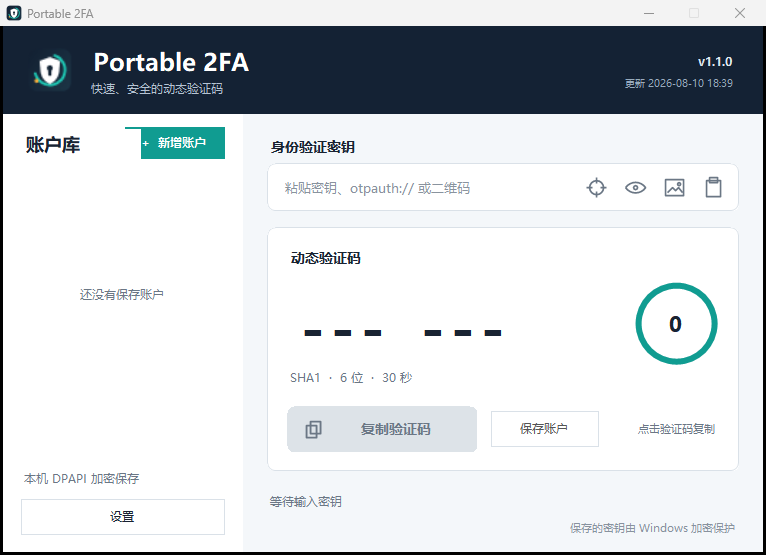
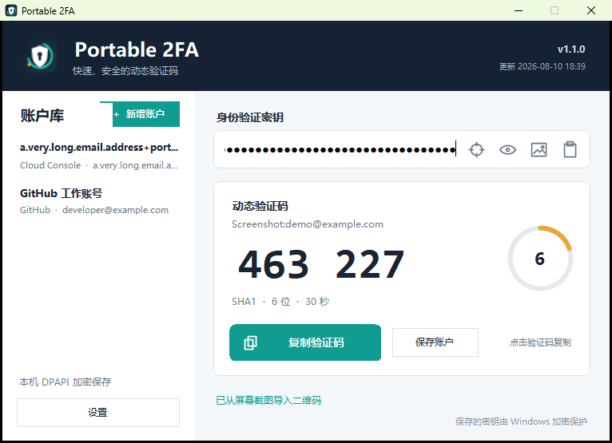
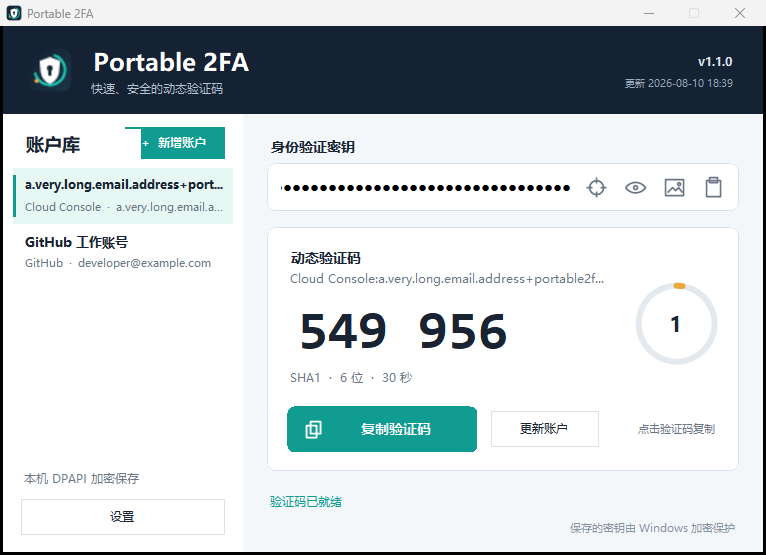
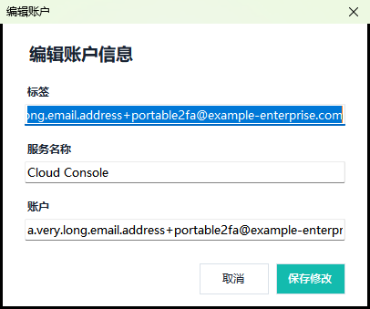
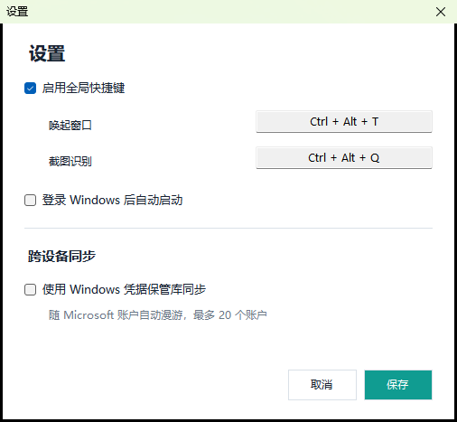

# Portable 2FA 使用说明

当前版本号和更新时间以项目根目录的 `version.json` 为准，并显示在软件界面右上角。

## 1. 直接生成验证码

1. 双击 `Portable2FA.exe`。
2. 在“身份验证密钥”中粘贴 Base32 密钥或 `otpauth://` 链接。
3. 查看动态验证码和环形剩余时间。
4. 点击验证码或“复制验证码”按钮写入剪贴板。

支持 SHA1、SHA256、SHA512，6/8 位验证码和 5 至 300 秒周期。



## 2. 导入二维码

输入框右侧四个图标从左到右是：截图识别、显示/隐藏密钥、选择图片、粘贴。

### 从图片文件导入

点击图片图标，选择包含 2FA 二维码的 PNG、JPG、BMP、GIF 或 TIFF 文件。识别成功后
会生成验证码，但不会自动保存账户。

### 从剪贴板导入

先复制二维码图片，再点击粘贴图标。程序会优先读取剪贴板图片并识别二维码；剪贴板是
普通文本时，会将其作为 Base32 密钥或 `otpauth://` 链接处理。

### 截图识别

点击准星图标或按默认快捷键 `Ctrl+Alt+Q`，鼠标拖动框选屏幕上的二维码。松开后自动
识别，按 `Esc` 取消。截图只在进程内用于识别，不会自动保存为图片文件。




## 3. 保存和管理账户

1. 点击“＋ 新增账户”开始录入。这个按钮只会清空当前编辑状态，不会立即保存。
2. 输入密钥或导入二维码，确认验证码已正确生成。
3. 点击“保存账户”。
4. 填写必填标签，可选填服务名称和账户。
5. 点击“保存”，账户出现在左侧账户库。

标签建议填写容易辨认的名称，例如“GitHub 工作账号”或登录邮箱。对于很长的邮箱/标签，
列表会先缩小字号再以省略号收尾，防止文字覆盖其他内容；把鼠标停在条目上可以查看完整
标签、服务和账户。保存与编辑弹窗始终保留完整原文。





选择列表条目可加载验证码，点击“更新账户”可修改标签、服务或账户；右键条目可以编辑
或删除。只有用户主动保存的账户会写入加密库。

本地账户库位置：`%LOCALAPPDATA%\Portable2FA\vault.dat`。文件整体使用 Windows DPAPI
CurrentUser 加密，只能由同一 Windows 用户上下文解密。

## 4. Windows 跨设备同步

1. 点击左下角“设置”。
2. 启用“Windows 账户同步”。
3. 点击“保存设置”。

同步使用 Windows Credential Locker 和 Microsoft 账户的系统凭据漫游，不需要拷贝
`vault.dat`。当前最多同步 20 个有效账户。域/组织策略限制 Credential Locker、未使用
支持漫游的 Microsoft 账户或系统关闭凭据漫游时，同步可能不可用。

Windows Hello 只负责设备上的身份验证，不是本项目的同步方式。本地 DPAPI 加密库仍会
保留，未启用 Windows 同步时账户只存在当前 Windows 用户中。

## 5. 自定义全局快捷键

默认快捷键：

- `Ctrl+Alt+T`：显示主窗口。
- `Ctrl+Alt+Q`：截图识别二维码。

进入“设置”，点击快捷键输入框后直接按下新的组合键，再保存。如果快捷键被其他程序
占用，主窗口会提示注册失败，此时换一个组合键即可。

## 6. 开机启动

在设置中启用“登录 Windows 后自动启动”。程序会写入当前用户 Run 注册表项，并使用
`--startup` 参数启动。登录后程序直接进入系统托盘，不会弹出主窗口。



## 7. 托盘操作

- 关闭窗口、最小化窗口或按 `Esc`：隐藏到托盘，验证码继续刷新。
- 双击托盘图标：恢复主窗口。
- 右键托盘图标：显示窗口、复制当前验证码、截图识别、打开设置或退出。
- 再次运行 EXE：唤醒已经运行的实例，不会重复启动多个进程。

## 8. 高 DPI 显示

程序支持 Per-Monitor V2 DPI 缩放。已覆盖 2560×1600、150% 缩放场景，主窗口、设置页
和保存账户弹窗会按 DPI 缩放，不再使用会造成内容显示不全的固定最大/最小尺寸。

## 9. 数据与隐私

- 未保存的密钥只存在当前进程内存中。
- 已保存账户使用 Windows DPAPI CurrentUser 加密。
- 启用同步后，账户另存入 Windows Credential Locker 并由系统负责漫游。
- 二维码、截图和 TOTP 计算都在本机完成。
- 应用没有自建服务器、遥测、广告或分析 SDK。
- 复制验证码后程序不会自动清除 Windows 剪贴板历史。

## 10. 重新构建

```powershell
.\build.ps1 -OutputDirectory .
```

构建脚本使用 Windows 自带 C# 编译器，把 ZXing.Net 嵌入单文件 EXE，并自动运行 27 项
RFC 6238、Base32、URI、账户序列化和二维码检查。

项目主页：<https://github.com/miao8818/Portable2FA>
